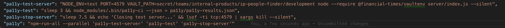

### Accessibility Exploration

Keen to learn more about accessibility and how it's a responsibility of a web developer to ensure the features and products they build are consumable by as many people as possible, regardless of the use of assisted technology. 

#### Tools
1. [Pa11y](https://github.com/pa11y/pa11y/tree/e044480b14c84c489b2f5846567dd252ad9018cf#examples)
##### Live App:
Used the cli (rather than node option) to run the following queries against a basic javascript and html [chess game repo](https://github.com/CLTPayne/pairing-rowan):

```pa11y http://127.0.0.1:8080/chessboard.html -S ./pa11yOutputs/screenCaptureLocalServedChessSite.png -r json > ./pa11yOutputs/reportLocalServedChessSite.json```

This runs the test against the whole home page, and encountered 31 errors (plus further notices and warnings that you can choose to include in the output with `--include-warnings` or `--include-notices`). 

You can also see a snapshot of the site the report has been run against. This confirms that the test has been run against the intended portion of the site. 

##### Absolute Path To HTML:
```pa11y ~/Documents/Projects/pairing-rowan/chessboard.html -S ./pa11yOutputs/screenCaptureAbsolutePathToChessHTML.png -r json > ./pa11yOutputs/reportAbsolutePathToChessHTML.json```

This means that anything rendered with javascript or not client rendered will not be part of the tested page. You can see this evidenced in the screenshots included in this repo. 

Learning:
1. Really need to run against the served site. 

Issue:
1. How to access the other pages of the app?

Iteration 1: 
#### Parallel NPM Script: 
Use `npm-run-all` to run a series of scripts in parallel. This enables spinning up the server for running the application locally. 
Adding in a sleep / wait in order to allow time for the site to build and in order to shut down the app. 


Goal - the most simple implementation that shows devs the errors but doen't error / exit any process with a non `0` value. 

- Decided to use a node script to enable running of `pa11y` with multiple urls. 
- Implemented with [shelljs](https://www.npmjs.com/package/shelljs) as it enables use of the linux shell within node. 
- By using Javascript this is hopefully more familar than a bash script, and will not need executing rights. 
- The object data structure means that urls can be reference by property and value, enabling dynamically named screenshot output.
- Exit code is 0 regardless of whether test pass or fail. 
- Add bespoke messaging via Javascript to amplify the pa11y output.
- Assumes that the application is all ready built and running.

Next steps:
    - Add to a test script (last part or first part?)

Feedback - npm script using additional libraries adds further dependencies to the system that need to be maintained. Why not achive this without `shelljs`?

Iteration 2:

Goal - in some environments, when there is setup to spin up a version of the application for e2e tests, this is potentially worth piggy backing on to run Pa11y in CI. Discussed with teams and feel this would be annoying if builds silently broke but could be great for raising awareness if you could have a 'job' in Circle Ci that was not required for a deploy but was kicked of post build and showed red if issues were found with accessibility. When the team is upto date / more familiar can also add as a pre-push step. 

1. Implement `pa11y-ci` - selected as it's widely used across the FT. Regular `pa11y` does not work in CI. 
2. Follow any current functional / e2e test setup for consistency. Further to the default `pa11y-ci` output, add some extra messaging / colours have been added to increase visibility in the console.
3. Initial requirement was to output errors to the console but to not break the build on discovery of an error - script overrides the `pa11y-ci` exit code with `0` regardless of errors being found.
4. To ensure the process is easy for developers to maintain and update - `.pa11yci` config contains an array of URLs which can be extended for future endpoints / pages.

### Next Steps
a) When any current errors have been fixed change the exit code over ride to a breaking exit code. 

Example console output for this script:

